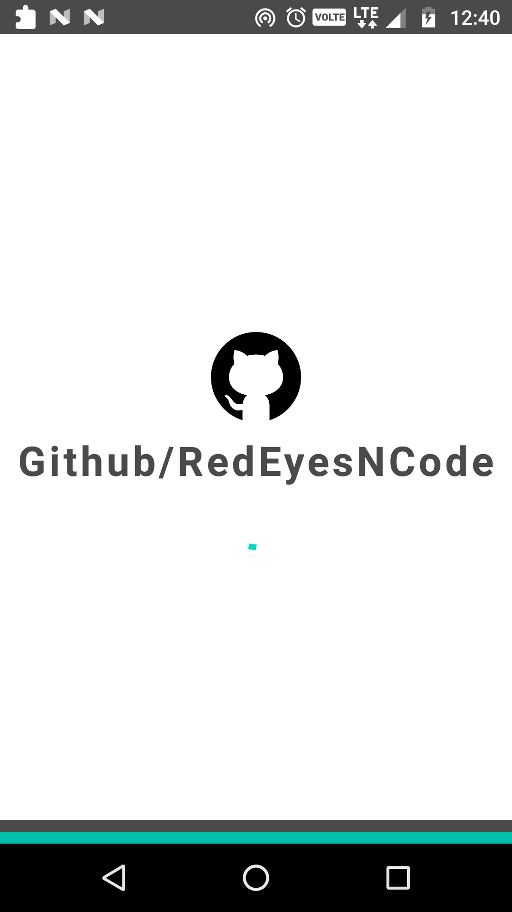
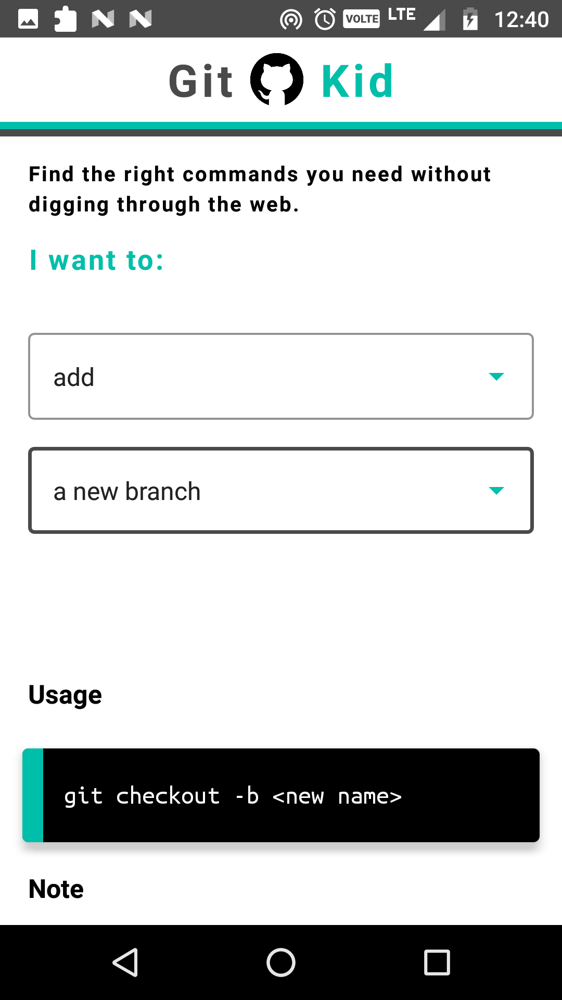

# Git-Kid
The Git Kid Android Developer.

**App made in kotlin to showcase all basic commands used around git for maintaining code base for android apps.**

**Screenshots of the App Developed**

<table>
  <tr>
    <td>App Screen</td>
     <td>App Screen</td>
   </tr>
  <tr>
    <td></td>
    <td></td>
  </tr>
 </table>

